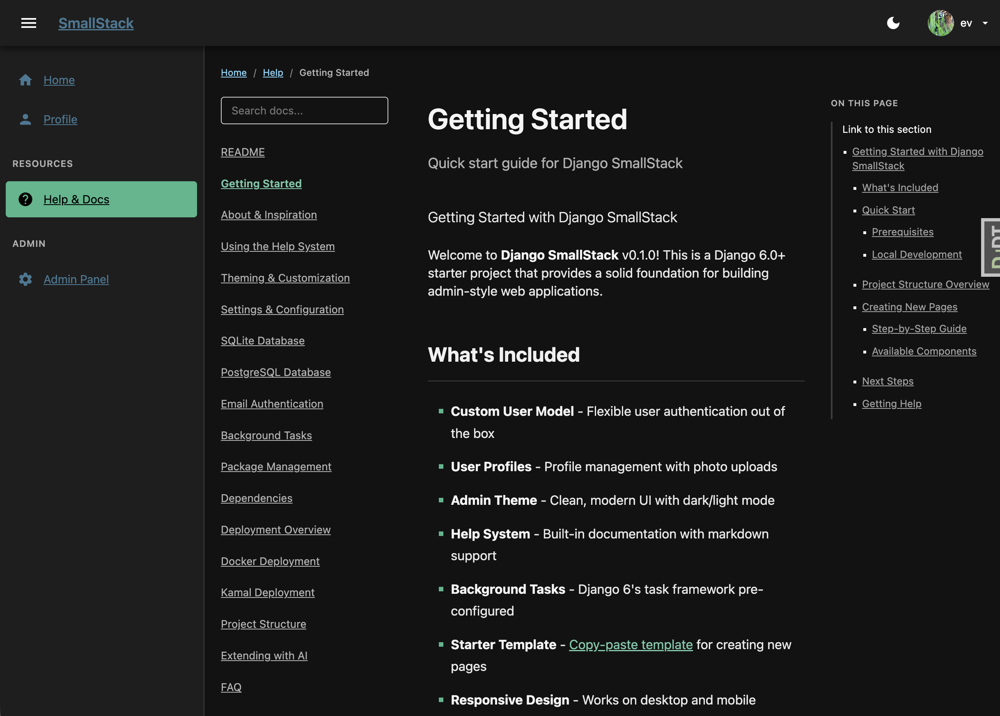

# Django SmallStack

*Django that's batteries-included for the AI era.*


[](docs/report-cards/v0.12.4.md)

[](SECURITY.md)

A small-footprint Django foundation for shipping **websites, API servers, MCP servers, and background-task systems** — with Explorer, CRUDView, and a model-to-API-to-MCP pipeline already wired up. SQLite-first, no external services required.

> **A note on "background tasks" vs "schedulers"**: SmallStack ships a one-shot
> background-task queue (django-tasks-db + a worker via `manage.py db_worker`).
> **Coming soon:** a recurring `@scheduled(every="5m")` primitive (retries with
> backoff, dead-letter handling). Until it lands, recurring jobs run as
> management commands triggered by system cron.

📖 **Docs, guides, and examples → [www.smallstack.site](https://www.smallstack.site/)**

> Pre-1.0 and changing rapidly. APIs and conventions will stabilize at 1.0.


## One model, three surfaces

The headline pattern: a single `CRUDView` declaration produces an HTML admin page, REST endpoints, and MCP tools.

```python
class TicketCRUDView(CRUDView):
    model           = Ticket
    actions         = [Action.LIST, Action.CREATE, Action.DETAIL, Action.UPDATE, Action.DELETE]
    filter_fields   = ["status", "priority", "customer"]
    url_base        = "tickets"
    enable_api      = True     # → REST  <include-prefix>/api/tickets/
    enable_mcp      = True     # → MCP   list_tickets, create_ticket, … (opt-in)
    enable_explorer = True     # → HTML  /smallstack/explorer/support/ticket/
```

Same form/queryset/permission logic, three surfaces. The REST URL is
`<include-prefix> + SMALLSTACK_API_PREFIX (default "api/") + url_base + "/"`,
where `<include-prefix>` is wherever your app's `urls.py` is mounted in
`config/urls.py`. So a CRUDView in `apps/support/` included under
`path("support/", include("apps.support.urls"))` emits the REST surface
at `/support/api/tickets/`. CRUD MCP tools require explicit
`enable_mcp = True` — the default install ships search-only MCP.

## Batteries included

Built-in apps that run themselves — no setup beyond `make setup`:

- **Explorer** — universal model browser with auto-generated CRUD pages
- **MCP server** — JSON-RPC + OAuth + PKCE at `/mcp`. Claude Desktop and Connectors UI work without setup
- **API server** — Bearer-auth REST + OpenAPI 3.0.3 + Swagger UI + ReDoc, emitted from CRUDViews
- **API admin** — `/smallstack/api/` health checks + threat panel (auth bursts, scanner UAs, path scanning)
- **MCP admin** — `/smallstack/mcp/` health + tools + activity admin pages
- **Activity** — request logging with auto-pruning, status breakdowns
- **API Tokens** — self-service mint / reveal-once / revoke
- **Backups** — SQLite snapshots, optional cron schedule
- **Status** — uptime monitoring + public status page
- **Help & Docs** — bundled reference + AI skill files
- **Background tasks** — DB-backed task queue, no Redis / Celery
- **Auth + Profile** — custom User model, photo, timezone, theme preference

## Quick start

**Prerequisites:** [uv](https://docs.astral.sh/uv/) and `make`. uv manages
the Python version automatically (`>=3.12`) — no system Python required.

```bash
# Install uv if you don't have it:
curl -LsSf https://astral.sh/uv/install.sh | sh   # macOS / Linux
# Windows: powershell -ExecutionPolicy ByPass -c "irm https://astral.sh/uv/install.ps1 | iex"
```

```bash
git clone https://github.com/emichaud/django-smallstack.git myapp
cd myapp
make setup    # uv sync + migrate + create dev superuser (admin/admin)
make run      # dev server on port 8005
```

Open http://localhost:8005, log in with `admin` / `admin`.

For Docker: `cp .env.example .env && docker compose up -d` (port 8010).

## Modern dark theme

Five palettes × two themes (light/dark) — switchable from the user-menu dropdown. The modern-dark default uses near-black surfaces with vibrant Tailwind-style accents (Linear / Vercel / Anthropic console aesthetic).

<p>
  
  
</p>

## Vibe coding with AI

SmallStack is tuned for clone-and-build-with-an-AI workflows. When you start a session with Claude Code / Cursor / similar:

- **`CLAUDE.md`** in the repo root orients the AI to the codebase and lists the read-first skills per task type
- **`docs/skills/modern-dark-theme.md`** is the prescriptive "before building a page, read this" guide — following it produces pages that work correctly across all five palettes on the first try (the most common AI-built-page failure mode is hard-coded colors)
- **`docs/skills/cli-tools.md`** is the task → tool decision tree — keeps the AI from hand-rolling backup scripts when `make backup` exists
- **`docs/skills/README.md`** indexes the full skill set (40+ files covering apps, theming, MCP, API, deployment, etc.)

## Development

```bash
make test          # pytest with coverage
make lint          # ruff check
make lint-fix      # ruff check --fix
make api-test      # API smoke test against running server
make mcp-test      # MCP smoke test
```

Visit `/help/` once running for full docs (getting started, theming, deployment, MCP setup, API patterns, and more).

## Quality & audits

Every release ships with a **quality report card** — a graded scorecard (security, code quality,
testing & coverage, docs, architecture, operability, accessibility) with the changes, findings, and
evidence behind it. See **[docs/report-cards/](docs/report-cards/)** — latest:
**[v0.12.4 — A−](docs/report-cards/v0.12.4.md)**.

What makes it trustworthy rather than self-congratulatory:

- **Independent** — cards are produced by a separate integration test harness
  ([smallstack-testing-agent](https://github.com/emichaud/smallstack-testing-agent)), not by grading
  ourselves. It clones a fresh copy and exercises it end-to-end.
- **Reproducible** — the rubric, data commands, and honesty rules are public
  ([docs/skills/report-card.md](docs/skills/report-card.md)); anyone can re-run them.
- **Honest** — grades are evidence-backed (tests, `pip-audit`, doctors) and un-inflated; an open
  security BLOCKER caps the whole card at F. The trajectory across releases is the point.

## Learn more

Full documentation, demos, examples, and the latest news live at **[www.smallstack.site](https://www.smallstack.site/)**.

That's the canonical reference for setup guides, palette details, the CRUDView pipeline, MCP setup, and downstream-project patterns. The bundled `/help/` docs in your local clone are a subset; the site has the long-form material.

## License

MIT — use it, modify it, ship it.
