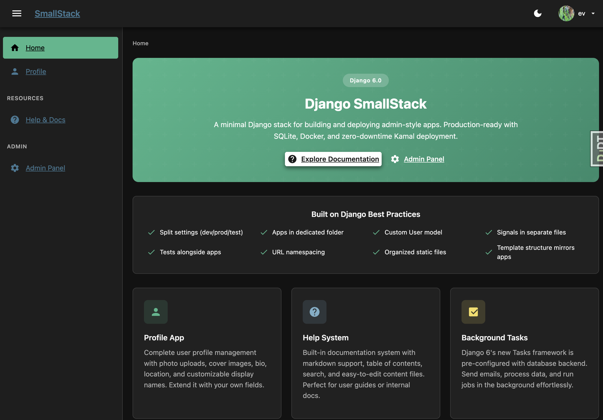
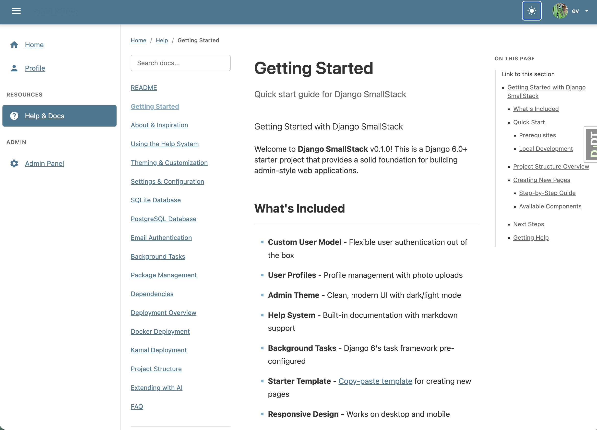

# Django SmallStack

*A minimal Django stack for building and deploying admin-style apps.*

A modern, batteries-included Django starter project built on Django's powerful admin foundation. Production-ready with SQLite, Docker, and zero-downtime Kamal deployment. Clone it, customize it, ship it.



## Features

### Profile App
Complete user profile management with photo uploads, cover images, bio, location, and customizable display names. Extend it with your own fields.


### Help System
Built-in documentation system with markdown support, table of contents, search, and easy-to-edit content files. Perfect for user guides or internal docs.

<p>
  
  
</p>

### Background Tasks
Django 6's new Tasks framework is pre-configured with database backend. Send emails, process data, and run jobs in the background effortlessly.

### Theming
Beautiful light and dark modes with CSS custom properties. Customize colors, shadows, and spacing from a single file. User preferences are saved.

### Authentication
Custom User model ready for email login. Password reset flows, secure sessions, and extensible auth patterns built on Django's proven foundation.

### Docker Ready
Production-ready Docker configuration with multi-service compose, health checks, and background worker. Deploy anywhere containers run.

### SQLite by Default
Production-ready SQLite configuration with the database stored outside the container. Perfect for solo developers, small teams, and internal applications. No database service fees—just simple, reliable data storage that backs up with your VPS. Upgrade to PostgreSQL when you need it.

## Built on Django Best Practices

- **Split settings** - Separate configurations for development, production, and testing
- **Apps in dedicated folder** - Clean organization with all apps in `apps/` directory
- **Custom User model** - Extensible user model from day one
- **Signals in separate files** - Clean separation of concerns
- **Tests alongside apps** - Tests live with their apps for easy maintenance
- **URL namespacing** - Organized URL patterns (e.g., `help:index`)
- **Organized static files** - Structured CSS and JavaScript
- **Template structure mirrors apps** - Intuitive template organization
- **SQLite with data separation** - Database stored in `/data/` directory, persists across container rebuilds

## Quick Start

### Prerequisites

- Python 3.12+
- [UV](https://github.com/astral-sh/uv) package manager (recommended)
- Docker Desktop (for containerized deployment)

### Local Development

1. **Clone and enter the project:**
   ```bash
   git clone https://github.com/YOUR_USERNAME/django-smallstack.git
   cd django-smallstack
   ```

2. **Install dependencies:**
   ```bash
   uv sync
   ```

3. **Set up environment variables:**
   ```bash
   cp .env.example .env
   # Edit .env with your settings
   ```

4. **Run migrations:**
   ```bash
   uv run python manage.py migrate
   ```

5. **Create a superuser:**
   ```bash
   uv run python manage.py create_dev_superuser
   ```

6. **Start the development server:**
   ```bash
   uv run python manage.py runserver
   ```

7. **Open your browser:**
   - Homepage: http://localhost:8000
   - Admin: http://localhost:8000/admin

### Docker Deployment

1. **Build and run:**
   ```bash
   docker-compose up -d
   ```

2. **Access the application:**
   - Homepage: http://localhost:8010

## Project Structure

```
django-smallstack/
├── apps/                      # Django applications
│   ├── accounts/              # Custom user model & auth
│   ├── smallstack/           # Theme helpers (pure presentation)
│   ├── profile/               # User profile management
│   ├── help/                  # Documentation system
│   └── tasks/                 # Background tasks
├── config/                    # Project configuration
│   └── settings/              # Split settings
│       ├── base.py            # Shared settings
│       ├── development.py     # Dev-specific settings
│       ├── production.py      # Production settings
│       └── test.py            # Test settings
├── templates/                 # HTML templates
│   ├── smallstack/           # Base templates, includes & marketing pages
│   │   └── pages/            # SmallStack marketing content
│   ├── website/              # Page wrappers (customize for your project)
│   ├── profile/               # Profile templates
│   ├── help/                  # Help system templates
│   └── registration/          # Auth templates
├── static/                    # Static files
│   ├── smallstack/            # Core theme, brand assets, help assets
│   ├── brand/                 # Project brand overrides
│   ├── css/                   # Project CSS overrides
│   └── js/                    # Project JS
├── docs/                      # Additional documentation
│   └── skills/                # AI assistant skill files
├── docker-compose.yml         # Docker composition
├── Dockerfile                 # Container definition
└── pyproject.toml             # Dependencies & tools config
```

## Built to Extend

SmallStack comes pre-populated with working examples and sensible defaults. Use it as-is for internal tools, or customize everything to build your vision.

- **Split settings for dev/prod** - Environment-specific configuration
- **UV package management** - Fast, modern Python packaging
- **Admin theme helpers** - Template tags for breadcrumbs, navigation
- **AI skill files included** - Documentation for AI assistants
- **Starter template page** - Component showcase at `/starter/`
- **Conflict-free customization** - Thin wrapper templates let you replace pages without upstream merge conflicts

## Development

### Running Tests

```bash
uv run pytest
```

### Code Quality

```bash
# Lint and fix
uv run ruff check --fix .

# Format
uv run ruff format .
```

### Background Worker

For development with background tasks:

```bash
uv run python manage.py db_worker
```

## Documentation

Once running, visit `/help/` for comprehensive documentation including:

- Getting Started guide
- Theming customization
- Docker deployment
- Background tasks
- Adding new pages

## License

MIT License - Use it, modify it, ship it.
